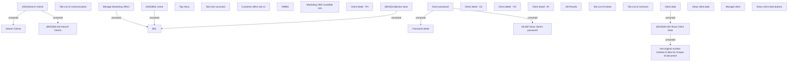

# Client detail

```mermaid
graph TD
    Manage_Marketing_Offers["Manage Marketing Offers"]
    Tab_List_of_communication["Tab List of communication"]
    Search_Clients["Search Clients"]
    MOD_06_040_Search_Clients["{MOD}06.040 Search Clients"]
    ADD_BSL_home["{ADD}BSL home"]
    ADD_Search_clients["{ADD}Search clients"]
    BSL["BSL"]
    Top_menu["Top menu"]
    Tab_User_accounts["Tab User accounts"]
    Customer_offers_tab_v2["Customer offers tab v2"]
    AMMIL["AMMIL"]
    Get_original_number_instead_of_alias_for_Unique_Id_document["Get original number instead of alias for Unique Id document"]
    Marketing_Offer_available_info["Marketing Offer available info"]
    Client_detail_PH["Client detail - PH"]
    Password_detail["Password detail"]
    MOD_Collection_tools["{MOD}Collection tools"]
    n_06_060_Show_client_s_password["06.060 Show client's password"]
    Client_password["Client password"]
    Client_detail_KZ["Client detail - KZ"]
    Client_detail_VN["Client detail - VN"]
    Client_detail_IN["Client detail - IN"]
    CB_Results["CB Results"]
    Tab_List_of_tickets["Tab List of tickets"]
    Tab_List_of_contracts["Tab List of contracts"]
    MOD_06_030_Show_Client_Data["{MOD}06.030 Show Client Data"]
    Client_data["Client data"]
    Show_client_data["Show client data"]
    Manage_client["Manage client"]
    Show_client_data_buttons["Show client data buttons"]
    Client_data["Client data"]
    Client_data -->|unnamed| MOD_06_030_Show_Client_Data
    Client_password -->|unnamed| n_06_060_Show_client_s_password
    Client_password -->|unnamed| Password_detail
    Manage_Marketing_Offers -->|unnamed| BSL
    ADD_BSL_home -->|unnamed| BSL
    MOD_Collection_tools -->|unnamed| BSL
    ADD_Search_clients -->|unnamed| MOD_06_040_Search_Clients
    ADD_Search_clients -->|unnamed| Search_Clients
    MOD_06_030_Show_Client_Data -->|unnamed| Get_original_number_instead_of_alias_for_Unique_Id_document
```
