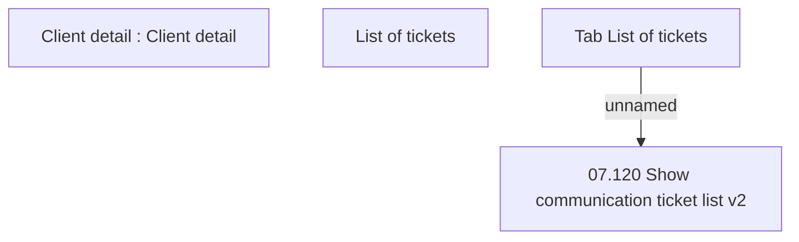

# Tab List of tickets

```mermaid
graph TD
    n_07_120_Show_communication_ticket_list_v2["07.120 Show communication ticket list v2"]
    Client_detail_Client_detail["Client detail : Client detail"]
    List_of_tickets["List of tickets"]
    Tab_List_of_tickets["Tab List of tickets"]
    Tab_List_of_tickets -->|unnamed| n_07_120_Show_communication_ticket_list_v2
```
