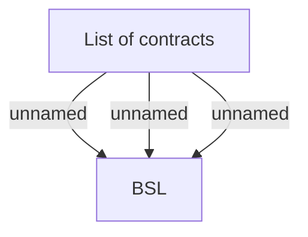

# List of contracts - ID

- **Diagram Type**: Custom
- **Package**: HomerSelect/BSL/Modules/Client center (CLC)/Analytical Model/Client Detail/User Interface Model/Header Client detail/ID
- **Diagram ID**: 156356
- **Elements**: 2
- **Connectors**: 3

