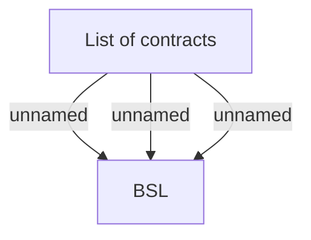

# List of contracts - ID

```mermaid
graph TD
    BSL["BSL"]
    List_of_contracts["List of contracts"]
    List_of_contracts -->|unnamed| BSL
    List_of_contracts -->|unnamed| BSL
    List_of_contracts -->|unnamed| BSL
```
