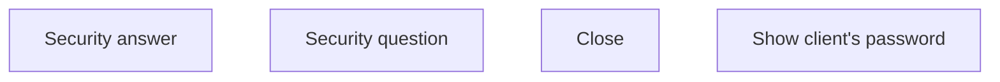

# Password detail

- **Diagram Type**: Custom
- **Package**: HomerSelect/BSL/Modules/Client center (CLC)/Analytical Model/Client Detail/User Interface Model/Header Client detail/IN
- **Diagram ID**: 156150
- **Elements**: 4
- **Connectors**: 0

