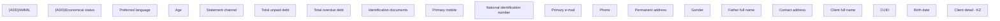

# Client detail - KZ

```mermaid
graph TD
    ADD_AMMIL["{ADD}AMMIL"]
    ADD_Economical_status["{ADD}Economical status"]
    Preferred_language["Preferred language"]
    Age["Age"]
    Statement_channel["Statement channel "]
    Total_unpaid_debt["Total unpaid debt"]
    Total_overdue_debt["Total overdue debt"]
    Identification_documents["Identification documents"]
    Primary_mobile["Primary mobile"]
    National_identification_number["National identification number"]
    Primary_e_mail["Primary e-mail"]
    Phone["Phone"]
    Permanent_address["Permanent address"]
    Gender["Gender"]
    Father_full_name["Father full name"]
    Contact_address["Contact address"]
    Client_full_name["Client full name"]
    CUID["CUID"]
    Birth_date["Birth date"]
    Client_detail_KZ["Client detail - KZ"]
```
