# Client detail - PH

- **Diagram Type**: Custom
- **Package**: HomerSelect/BSL/Modules/Client center (CLC)/Analytical Model/Client Detail/User Interface Model/Header Client detail/PH
- **Diagram ID**: 156258
- **Elements**: 15
- **Connectors**: 0

```mermaid
graph TD
    ADD_AMMIL["{ADD}AMMIL"]
    Statement_channel["Statement channel "]
    Primary_mobile["Primary mobile"]
    Gender["Gender"]
    Permanent_address["Permanent address"]
    Phone["Phone"]
    Primary_e_mail["Primary e-mail"]
    Preferred_languages["Preferred languages"]
    Contact_address["Contact address"]
    Birth_date["Birth date"]
    CUID["CUID"]
    Father_full_name["Father full name"]
    Client_full_name["Client full name"]
    Identification_documents["Identification documents"]
    Show_client_data_panel["Show client data panel"]
```

