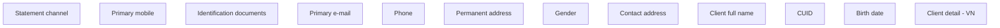

# Client detail - VN

```mermaid
graph TD
    Statement_channel["Statement channel "]
    Primary_mobile["Primary mobile"]
    Identification_documents["Identification documents"]
    Primary_e_mail["Primary e-mail"]
    Phone["Phone"]
    Permanent_address["Permanent address"]
    Gender["Gender"]
    Contact_address["Contact address"]
    Client_full_name["Client full name"]
    CUID["CUID"]
    Birth_date["Birth date"]
    Client_detail_VN["Client detail - VN"]
```
