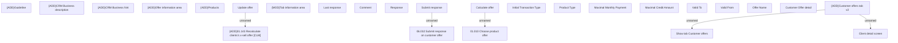

# Customer offers tab v2

```mermaid
graph TD
    n_01_010_Choose_product_offer["01.010 Choose product offer"]
    ADD_01_143_Recalculate_clients_s_x_sell_offer_CLM["{ADD}01.143 Recalculate clients's x-sell offer [CLM]"]
    ADD_Guideline["{ADD}Guideline"]
    ADD_CRM_Business_description["{ADD}CRM Business description"]
    ADD_CRM_Business_hint["{ADD}CRM Business hint"]
    ADD_Offer_information_area["{ADD}Offer information area"]
    ADD_Products["{ADD}Products"]
    Show_tab_Customer_offers["Show tab Customer offers"]
    Update_offer["Update offer"]
    MOD_Tab_information_area["{MOD}Tab information area"]
    n_06_032_Submit_response_on_customer_offer["06.032 Submit response on customer offer"]
    Client_detail_screen["Client detail screen"]
    Last_response["Last response"]
    Comment["Comment"]
    Response["Response"]
    Submit_response["Submit response"]
    Calculate_offer["Calculate offer"]
    Initial_Transaction_Type["Initial Transaction Type"]
    Product_Type["Product Type"]
    Maximal_Monthly_Payment["Maximal Monthly Payment"]
    Maximal_Credit_Amount["Maximal Credit Amount"]
    Valid_To["Valid To"]
    Valid_From["Valid From"]
    Offer_Name["Offer Name"]
    Customer_Offer_detail["Customer Offer detail"]
    ADD_Customer_offers_tab_v2["{ADD}Customer offers tab v2"]
    ADD_Customer_offers_tab_v2 -->|unnamed| Show_tab_Customer_offers
    ADD_Customer_offers_tab_v2 -->|unnamed| Client_detail_screen
    Calculate_offer -->|unnamed| n_01_010_Choose_product_offer
    Submit_response -->|unnamed| n_06_032_Submit_response_on_customer_offer
    Update_offer -->|unnamed| ADD_01_143_Recalculate_clients_s_x_sell_offer_CLM
```
