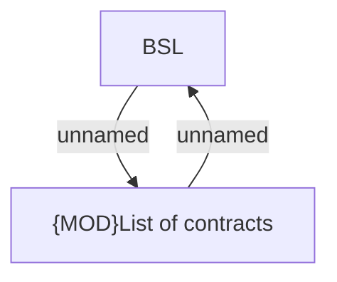

# List of contracts - Default

```mermaid
graph TD
    BSL["BSL"]
    MOD_List_of_contracts["{MOD}List of contracts"]
    BSL -->|unnamed| MOD_List_of_contracts
    MOD_List_of_contracts -->|unnamed| BSL
```
