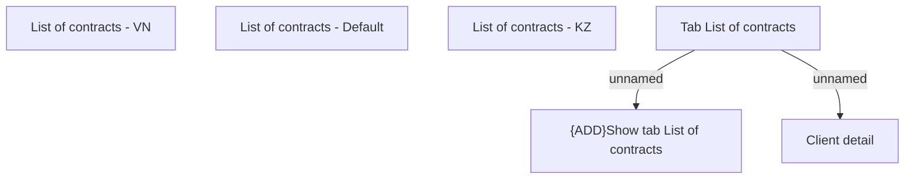

# Tab List of contracts

```mermaid
graph TD
    Client_detail["Client detail"]
    ADD_Show_tab_List_of_contracts["{ADD}Show tab List of contracts"]
    List_of_contracts_VN["List of contracts - VN"]
    List_of_contracts_Default["List of contracts - Default"]
    List_of_contracts_KZ["List of contracts - KZ"]
    Tab_List_of_contracts["Tab List of contracts"]
    Tab_List_of_contracts -->|unnamed| ADD_Show_tab_List_of_contracts
    Tab_List_of_contracts -->|unnamed| Client_detail
```
