# Tab User accounts

- **Diagram Type**: Custom
- **Package**: HomerSelect/BSL/Modules/Client center (CLC)/Analytical Model/Client Detail/User Interface Model/Tab User Accounts
- **Diagram ID**: 156152
- **Elements**: 17
- **Connectors**: 3

```mermaid
graph TD
    ADD_Show_tab_User_accounts["{ADD}Show tab User accounts"]
    User_account_login_history["User account login history"]
    ADD_User_account_login_history["{ADD}User account login history"]
    Last_failed_login["Last failed login"]
    Last_login["Last login"]
    Facebook_account["Facebook account"]
    Registration_email["Registration email"]
    Registration_phone["Registration phone"]
    Registration_date["Registration date"]
    Account_status["Account status"]
    Username["Username"]
    Show_login_history["Show login history"]
    ADD_Unblock_user["{ADD}Unblock user"]
    ADD_Block_user["{ADD}Block user"]
    User_Account["User Account"]
    ADD_Tab_User_Accounts["{ADD}Tab User Accounts"]
    Client_detail_screen["Client detail screen"]
    ADD_Tab_User_Accounts -->|unnamed| Client_detail_screen
    Show_login_history -->|unnamed| ADD_User_account_login_history
    ADD_Tab_User_Accounts -->|unnamed| ADD_Show_tab_User_accounts
```

