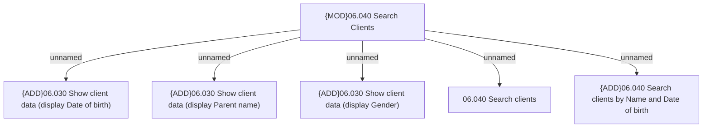

# Access Rights

- **Diagram Type**: Custom
- **Package**: HomerSelect/BSL/Modules/Client center (CLC)/Analytical Model/Client Search/Access Rights
- **Diagram ID**: 156133
- **Elements**: 6
- **Connectors**: 5

