# Validation rules

- **Diagram Type**: Custom
- **Package**: HomerSelect/BSL/Modules/Client center (CLC)/Analytical Model/Client Search/Validation rules
- **Diagram ID**: 156144
- **Elements**: 19
- **Connectors**: 13

```mermaid
graph TD
    Middle_name_validation["Middle name validation"]
    National_identification_number_validation["National identification number validation"]
    MAX_LENGTH_12["MAX_LENGTH=12"]
    Surname_has_to_be_filled["Surname has to be filled"]
    Number_is_required["Number is required"]
    MAX_LENGTH_50["MAX_LENGTH = 50"]
    MAX_LENGTH_30["MAX_LENGTH = 30"]
    MAX_LENGTH_18["MAX_LENGTH = 18"]
    MAX_LENGTH_16["MAX_LENGTH = 16"]
    First_name_validation["First name validation"]
    First_name_has_to_be_filled["First name has to be filled"]
    Document_Number_validation["Document Number validation"]
    Document_Number_has_to_be_filled["Document Number has to be filled"]
    Contract_validation["Contract validation"]
    Contact_validation["Contact validation"]
    CUID_validation["CUID validation"]
    Birth_date_has_to_be_filled["Birth date has to be filled"]
    Birth_date_dependency["Birth date dependency"]
    Surname_validation["Surname validation"]
    Birth_date_dependency -->|unnamed| Birth_date_has_to_be_filled
    Document_Number_validation -->|unnamed| Document_Number_has_to_be_filled
    First_name_validation -->|unnamed| First_name_has_to_be_filled
    Contract_validation -->|unnamed| MAX_LENGTH_16
    Document_Number_validation -->|unnamed| MAX_LENGTH_18
    CUID_validation -->|unnamed| MAX_LENGTH_18
    Middle_name_validation -->|unnamed| MAX_LENGTH_30
    First_name_validation -->|unnamed| MAX_LENGTH_30
    Surname_validation -->|unnamed| MAX_LENGTH_30
    Contact_validation -->|unnamed| MAX_LENGTH_50
    CUID_validation -->|unnamed| Number_is_required
    Surname_validation -->|unnamed| Surname_has_to_be_filled
    National_identification_number_validation -->|unnamed| MAX_LENGTH_12
```

