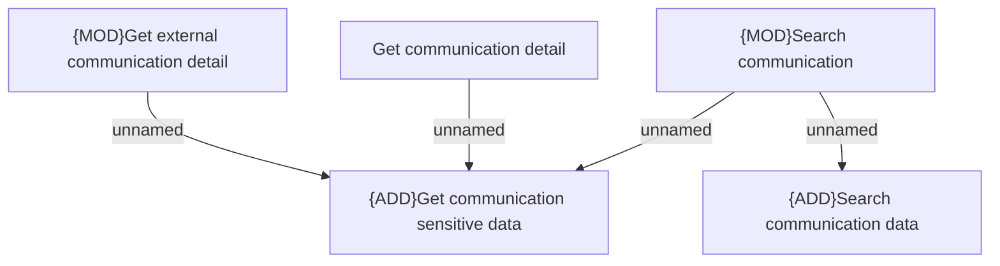

# Access Rights

- **Diagram Type**: Custom
- **Package**: HomerSelect/BSL/Modules/Client center (CLC)/Analytical Model/Communication/Client Composite Communication/Access Rights
- **Diagram ID**: 156265
- **Elements**: 5
- **Connectors**: 4

