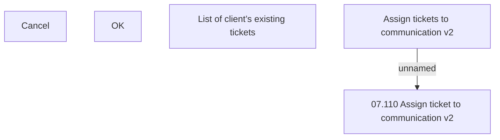

# Assign tickets to communication V2

- **Diagram Type**: Custom
- **Package**: HomerSelect/BSL/Modules/Client center (CLC)/Analytical Model/Communication/Manage communication/User Interface/Assign tickets to communication
- **Diagram ID**: 156291
- **Elements**: 5
- **Connectors**: 1

