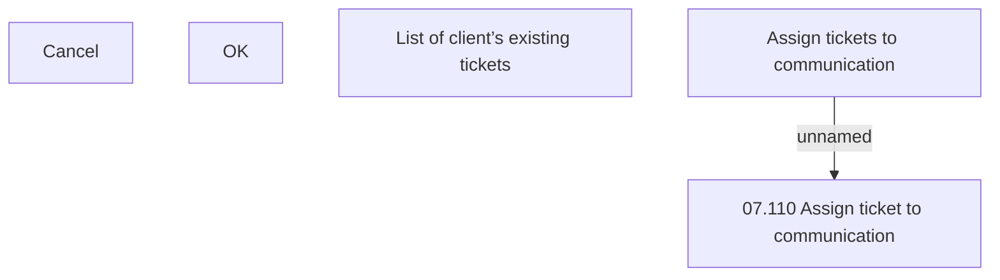

# Assign tickets to communication

```mermaid
graph TD
    n_07_110_Assign_ticket_to_communication["07.110 Assign ticket to communication"]
    Cancel["Cancel"]
    OK["OK"]
    List_of_client_s_existing_tickets["List of client’s existing tickets"]
    Assign_tickets_to_communication["Assign tickets to communication"]
    Assign_tickets_to_communication -->|unnamed| n_07_110_Assign_ticket_to_communication
```
