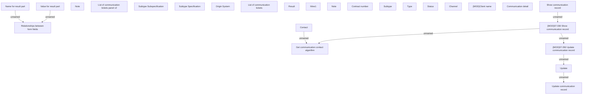

# Show communication record

```mermaid
graph TD
    Relationships_between_form_fields["Relationships between form fields"]
    Name_for_result_part["Name for result part"]
    Value_for_result_part["Value for result part"]
    el_1802092["Note"]
    List_of_communication_tickets_panel_v2["List of communication tickets panel v2"]
    Subtype_Subspecification["Subtype Subspecification"]
    Subtype_Specification["Subtype Specification"]
    Origin_System["Origin System"]
    Update_communication_record["Update communication record"]
    List_of_communication_tickets["List of communication tickets"]
    Get_communication_contact_algorithm["Get communication contact algorithm"]
    MOD_07_030_Show_communication_record["{MOD}07.030 Show communication record"]
    MOD_07_050_Update_communication_record["{MOD}07.050 Update communication record"]
    Result["Result"]
    hline1["hline1"]
    Note["Note"]
    Contract_number["Contract number"]
    Subtype["Subtype"]
    Type["Type"]
    Contact["Contact"]
    Status["Status"]
    Channel["Channel"]
    MOD_Client_name["{MOD}Client name"]
    Communication_detail["Communication detail"]
    Update["Update"]
    Show_communication_record["Show communication record"]
    Show_communication_record -->|unnamed| MOD_07_030_Show_communication_record
    Contact -->|unnamed| Get_communication_contact_algorithm
    Update -->|unnamed| Update_communication_record
    Name_for_result_part -->|unnamed| Relationships_between_form_fields
    Value_for_result_part -->|unnamed| Relationships_between_form_fields
    MOD_07_030_Show_communication_record -->|unnamed| Get_communication_contact_algorithm
    MOD_07_030_Show_communication_record -->|unnamed| MOD_07_050_Update_communication_record
    MOD_07_050_Update_communication_record -->|unnamed| Update
```
