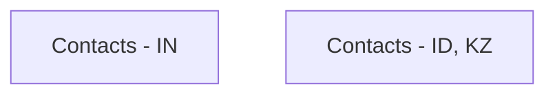

# Contacts

- **Diagram Type**: Custom
- **Package**: HomerSelect/BSL/Modules/Client center (CLC)/Analytical Model/Communication/Manage communication/User Interface/Create communication/Contacts
- **Diagram ID**: 156359
- **Elements**: 2
- **Connectors**: 0

