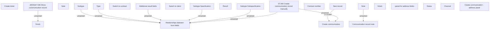

# Create communication

```mermaid
graph TD
    Create_ticket["Create ticket"]
    MOD_07_030_Show_communication_record["{MOD}07.030 Show communication record"]
    el_1852659["Note"]
    Subtype_Subspecification["Subtype Subspecification"]
    Subtype_Specification["Subtype Specification"]
    Communication_record_note["Communication record note"]
    Finish["Finish"]
    Switch_to_contract["Switch to contract"]
    n_07_040_Create_communication_record_manually["07.040 Create communication record manually"]
    Switch_to_client["Switch to client"]
    New_record["New record"]
    Result["Result"]
    Additional_result_fields["Additional result fields"]
    Note["Note"]
    Contract_number["Contract number"]
    Subtype["Subtype"]
    Type["Type"]
    hline1["hline1"]
    panel_for_address_fields["‹panel for address fields›"]
    Status["Status"]
    Channel["Channel"]
    Create_communication_address_panel["Create communication - address panel"]
    Relationships_between_form_fields["Relationships between form fields"]
    Create_communication["Create communication"]
    New_record -->|unnamed| Create_communication
    Subtype -->|unnamed| Relationships_between_form_fields
    Type -->|unnamed| Relationships_between_form_fields
    Additional_result_fields -->|unnamed| Relationships_between_form_fields
    Subtype_Specification -->|unnamed| Relationships_between_form_fields
    Subtype_Subspecification -->|unnamed| Relationships_between_form_fields
    Note -->|unnamed| Communication_record_note
    MOD_07_030_Show_communication_record -->|unnamed| Finish
    n_07_040_Create_communication_record_manually -->|unnamed| Create_communication
    n_07_040_Create_communication_record_manually -->|unnamed| Relationships_between_form_fields
```
