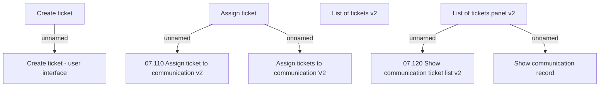

# List of communication tickets panel v2

- **Diagram Type**: Custom
- **Package**: HomerSelect/BSL/Modules/Client center (CLC)/Analytical Model/Communication/Manage communication/User Interface/List of communication tickets
- **Diagram ID**: 156358
- **Elements**: 9
- **Connectors**: 5

