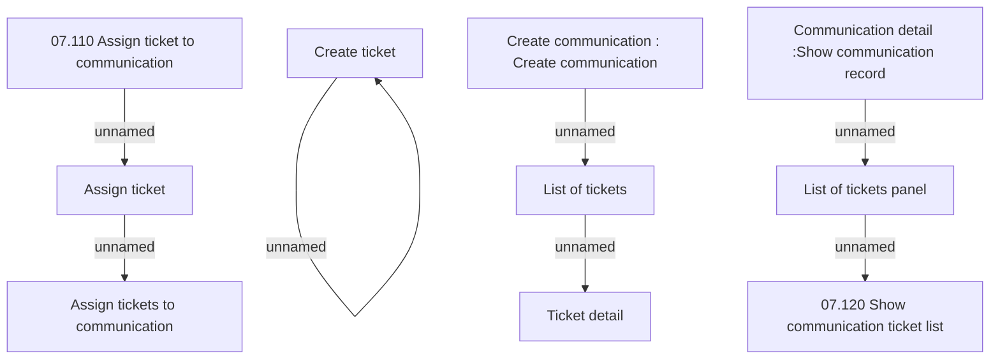

# List of communication tickets

- **Diagram Type**: Custom
- **Package**: HomerSelect/BSL/Modules/Client center (CLC)/Analytical Model/Communication/Manage communication/User Interface/List of communication tickets
- **Diagram ID**: 156290
- **Elements**: 11
- **Connectors**: 7

