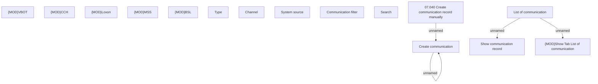

# List of communication

```mermaid
graph TD
    MOD_VBOT["{MOD}VBOT"]
    MOD_CCH["{MOD}CCH"]
    MOD_Loxon["{MOD}Loxon"]
    MOD_MSS["{MOD}MSS"]
    MOD_BSL["{MOD}BSL"]
    Type["Type"]
    Channel["Channel"]
    System_source["System source"]
    Communication_filter["Communication filter"]
    Search["Search"]
    Create_communication["Create communication"]
    Show_communication_record["Show communication record"]
    n_07_040_Create_communication_record_manually["07.040 Create communication record manually"]
    MOD_Show_Tab_List_of_communication["{MOD}Show Tab List of communication"]
    Create_communication["Create communication"]
    List_of_communication["List of communication"]
    List_of_communication["List of communication"]
    n_07_040_Create_communication_record_manually -->|unnamed| Create_communication
    List_of_communication -->|unnamed| MOD_Show_Tab_List_of_communication
    List_of_communication -->|unnamed| Show_communication_record
    Create_communication -->|unnamed| Create_communication
```
