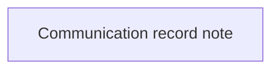

# Validation Rules

- **Diagram Type**: Custom
- **Package**: HomerSelect/BSL/Modules/Client center (CLC)/Analytical Model/Communication/Manage communication/Validation Rules
- **Diagram ID**: 156280
- **Elements**: 1
- **Connectors**: 0

