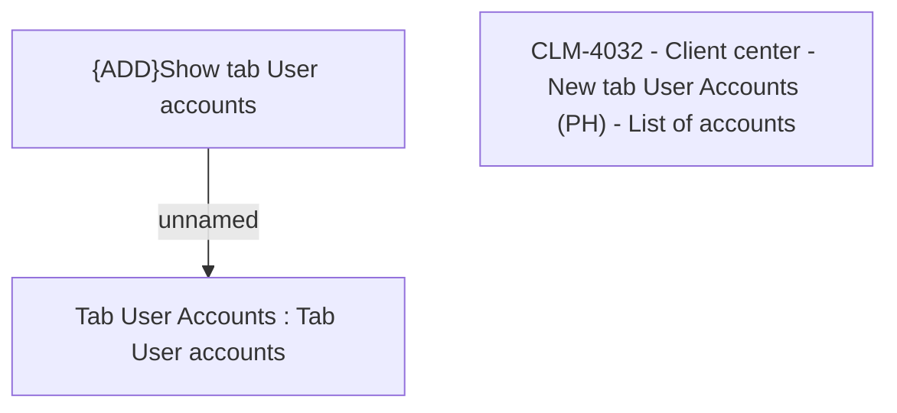

# CLM-4032 - Client center - New tab User Accounts (PH) - List of accounts

- **Diagram Type**: Custom
- **Package**: HomerSelect/BSL/Modules/Client center (CLC)/Requirements/CBL-11232/CLM-4032 - Client center - New tab User Accounts (PH) - List of accounts
- **Diagram ID**: 156154
- **Elements**: 3
- **Connectors**: 1

