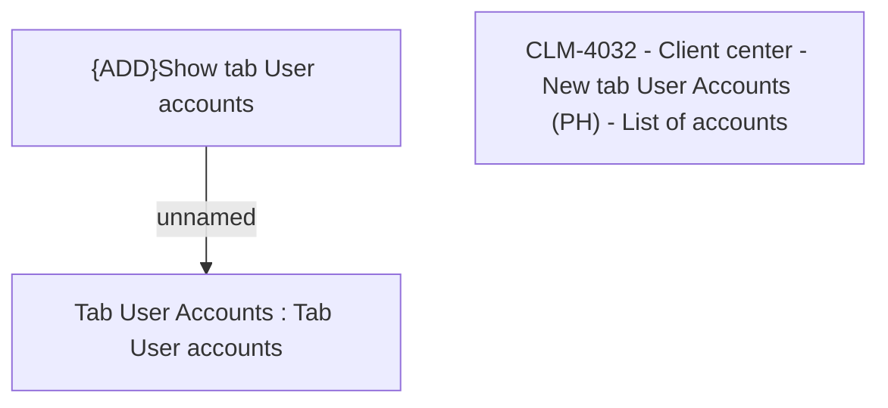

# CLM-4032 - Client center - New tab User Accounts (PH) - List of accounts

```mermaid
graph TD
    Tab_User_Accounts_Tab_User_accounts["Tab User Accounts : Tab User accounts"]
    ADD_Show_tab_User_accounts["{ADD}Show tab User accounts"]
    CLM_4032_Client_center_New_tab_User_Accounts_PH_List_of_acco["CLM-4032 - Client center - New tab User Accounts (PH) - List of accounts"]
    ADD_Show_tab_User_accounts -->|unnamed| Tab_User_Accounts_Tab_User_accounts
```
