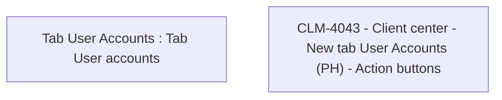

# CLM-4043 - Client center - New tab User Accounts (PH) - Action buttons

- **Diagram Type**: Custom
- **Package**: HomerSelect/BSL/Modules/Client center (CLC)/Requirements/CBL-11232/CLM-4043 - Client center - New tab User Accounts (PH) - Action buttons
- **Diagram ID**: 156155
- **Elements**: 2
- **Connectors**: 0

