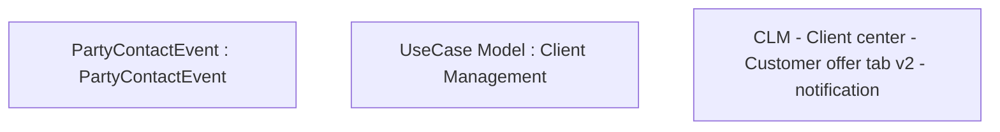

# CLM-3701 - Client center - Customer offer tab v2 - notification

- **Diagram Type**: Custom
- **Package**: HomerSelect/BSL/Modules/Client center (CLC)/Requirements/CBL-11677/CLM-3701 - Client center - Customer offer tab v2
- **Diagram ID**: 156158
- **Elements**: 3
- **Connectors**: 0

