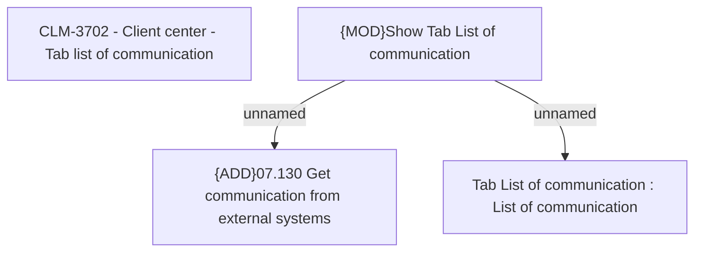

# CLM-3702 - Client center - Tab list of communication

```mermaid
graph TD
    CLM_3702_Client_center_Tab_list_of_communication["CLM-3702 - Client center - Tab list of communication"]
    Tab_List_of_communication_List_of_communication["Tab List of communication : List of communication"]
    ADD_07_130_Get_communication_from_external_systems["{ADD}07.130 Get communication from external systems"]
    MOD_Show_Tab_List_of_communication["{MOD}Show Tab List of communication"]
    MOD_Show_Tab_List_of_communication -->|unnamed| ADD_07_130_Get_communication_from_external_systems
    MOD_Show_Tab_List_of_communication -->|unnamed| Tab_List_of_communication_List_of_communication
```
