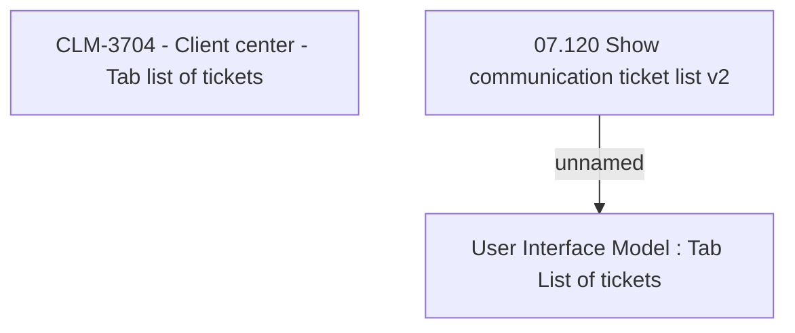

# CLM-3704 - Client Center - Tab List of tickets

```mermaid
graph TD
    CLM_3704_Client_center_Tab_list_of_tickets["CLM-3704 - Client center - Tab list of tickets"]
    User_Interface_Model_Tab_List_of_tickets["User Interface Model : Tab List of tickets"]
    n_07_120_Show_communication_ticket_list_v2["07.120 Show communication ticket list v2"]
    n_07_120_Show_communication_ticket_list_v2 -->|unnamed| User_Interface_Model_Tab_List_of_tickets
```
