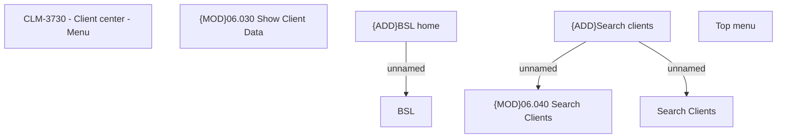

# CBL-11677 (CLM-3730) - Client center - Menu

- **Diagram Type**: Custom
- **Package**: HomerSelect/BSL/Modules/Client center (CLC)/Requirements/CBL-11677/CLM-3730 - Client center - Menu
- **Diagram ID**: 156163
- **Elements**: 8
- **Connectors**: 3

