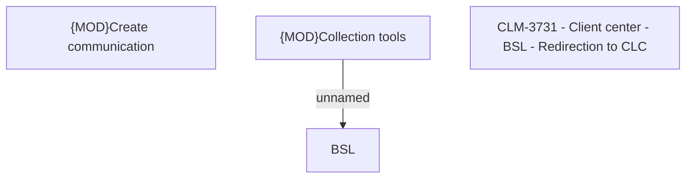

# CLM-3731 - Client center - BSL - Redirection to CLC

- **Diagram Type**: Custom
- **Package**: HomerSelect/BSL/Modules/Client center (CLC)/Requirements/CBL-11677/CLM-3731 - Client center - BSL - Redirection to CLC
- **Diagram ID**: 156164
- **Elements**: 4
- **Connectors**: 1

