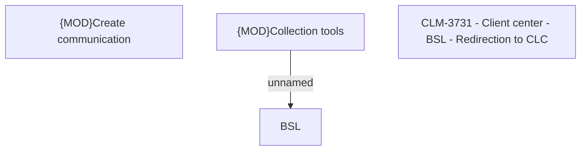

# CLM-3731 - Client center - BSL - Redirection to CLC

```mermaid
graph TD
    MOD_Create_communication["{MOD}Create communication"]
    BSL["BSL"]
    MOD_Collection_tools["{MOD}Collection tools"]
    CLM_3731_Client_center_BSL_Redirection_to_CLC["CLM-3731 - Client center - BSL - Redirection to CLC"]
    MOD_Collection_tools -->|unnamed| BSL
```
