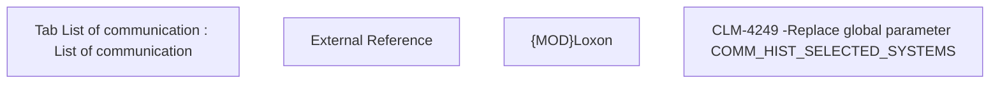

# CLM-4249 - Client center - List of communication - Add filter

```mermaid
graph TD
    Tab_List_of_communication_List_of_communication["Tab List of communication : List of communication"]
    External_Reference["External Reference"]
    External_Reference["External Reference"]
    MOD_Loxon["{MOD}Loxon"]
    External_Reference["External Reference"]
    External_Reference["External Reference"]
    CLM_4249_Replace_global_parameter_COMM_HIST_SELECTED_SYSTEMS["CLM-4249 -Replace global parameter COMM_HIST_SELECTED_SYSTEMS"]
```
