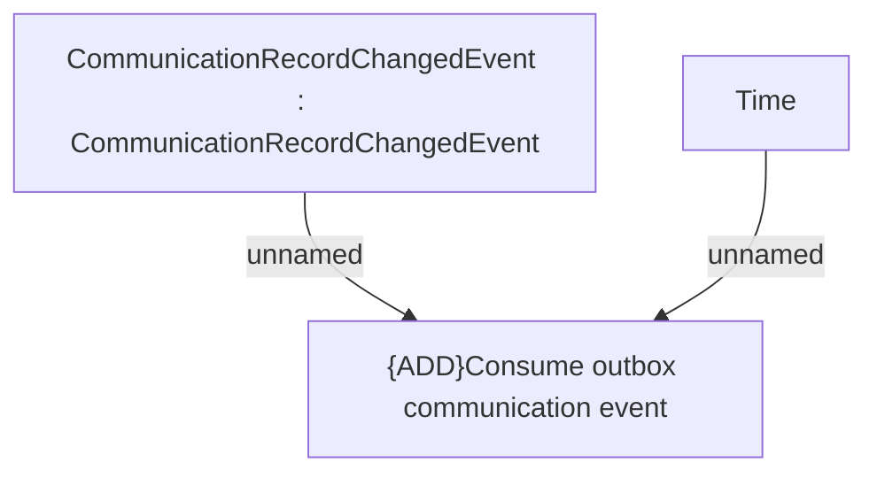

# CLM-4180 - Communication Data - CLC Kafka Connector

- **Diagram Type**: Custom
- **Package**: HomerSelect/BSL/Modules/Client center (CLC)/Requirements/CBL-11956/CLM-4180 - Communication Data - CLC Kafka Connector
- **Diagram ID**: 156166
- **Elements**: 3
- **Connectors**: 2

