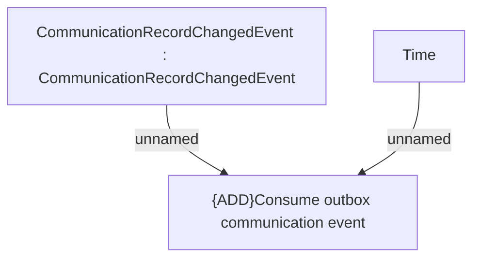

# CLM-4180 - Communication Data - CLC Kafka Connector

```mermaid
graph TD
    CommunicationRecordChangedEvent_CommunicationRecordChangedEv["CommunicationRecordChangedEvent : CommunicationRecordChangedEvent"]
    Time["Time"]
    ADD_Consume_outbox_communication_event["{ADD}Consume outbox communication event"]
    CommunicationRecordChangedEvent_CommunicationRecordChangedEv -->|unnamed| ADD_Consume_outbox_communication_event
    Time -->|unnamed| ADD_Consume_outbox_communication_event
```
