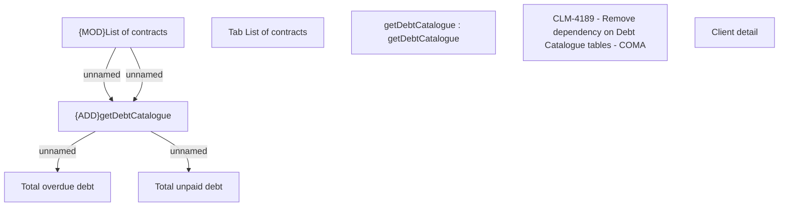

# CLM-4189 - Remove dependency on Debt Catalogue tables - COMA

```mermaid
graph TD
    MOD_List_of_contracts["{MOD}List of contracts"]
    Tab_List_of_contracts["Tab List of contracts"]
    Total_overdue_debt["Total overdue debt"]
    Total_unpaid_debt["Total unpaid debt"]
    getDebtCatalogue_getDebtCatalogue["getDebtCatalogue : getDebtCatalogue"]
    ADD_getDebtCatalogue["{ADD}getDebtCatalogue"]
    CLM_4189_Remove_dependency_on_Debt_Catalogue_tables_COMA["CLM-4189 - Remove dependency on Debt Catalogue tables - COMA"]
    Client_detail["Client detail"]
    MOD_List_of_contracts -->|unnamed| ADD_getDebtCatalogue
    MOD_List_of_contracts -->|unnamed| ADD_getDebtCatalogue
    ADD_getDebtCatalogue -->|unnamed| Total_overdue_debt
    ADD_getDebtCatalogue -->|unnamed| Total_unpaid_debt
```
