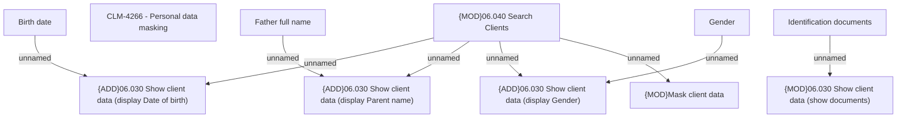

# CLM-4266 - Personal data masking

```mermaid
graph TD
    ADD_06_030_Show_client_data_display_Parent_name["{ADD}06.030 Show client data (display Parent name)"]
    ADD_06_030_Show_client_data_display_Gender["{ADD}06.030 Show client data (display Gender)"]
    ADD_06_030_Show_client_data_display_Date_of_birth["{ADD}06.030 Show client data (display Date of birth)"]
    MOD_Mask_client_data["{MOD}Mask client data"]
    MOD_06_040_Search_Clients["{MOD}06.040 Search Clients"]
    CLM_4266_Personal_data_masking["CLM-4266 - Personal data masking"]
    MOD_06_030_Show_client_data_show_documents["{MOD}06.030 Show client data (show documents)"]
    Identification_documents["Identification documents"]
    ADD_06_030_Show_client_data_display_Parent_name["{ADD}06.030 Show client data (display Parent name)"]
    ADD_06_030_Show_client_data_display_Gender["{ADD}06.030 Show client data (display Gender)"]
    ADD_06_030_Show_client_data_display_Date_of_birth["{ADD}06.030 Show client data (display Date of birth)"]
    Gender["Gender"]
    Father_full_name["Father full name"]
    Birth_date["Birth date"]
    Birth_date -->|unnamed| ADD_06_030_Show_client_data_display_Date_of_birth
    Identification_documents -->|unnamed| MOD_06_030_Show_client_data_show_documents
    Gender -->|unnamed| ADD_06_030_Show_client_data_display_Gender
    Father_full_name -->|unnamed| ADD_06_030_Show_client_data_display_Parent_name
    MOD_06_040_Search_Clients -->|unnamed| ADD_06_030_Show_client_data_display_Date_of_birth
    MOD_06_040_Search_Clients -->|unnamed| ADD_06_030_Show_client_data_display_Parent_name
    MOD_06_040_Search_Clients -->|unnamed| ADD_06_030_Show_client_data_display_Gender
    MOD_06_040_Search_Clients -->|unnamed| MOD_Mask_client_data
```
