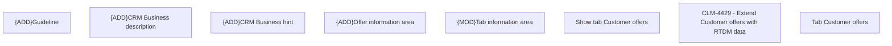

# CLM-4429  - Extend Customer offers with RTDM data

- **Diagram Type**: Custom
- **Package**: HomerSelect/BSL/Modules/Client center (CLC)/Requirements/CBL-15196/CLM-4429  - Extend Customer offers with RTDM data
- **Diagram ID**: 156171
- **Elements**: 8
- **Connectors**: 0

