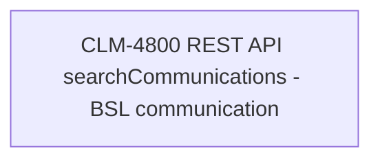

# CLM-4800 REST API searchCommunications - BSL communication

- **Diagram Type**: Custom
- **Package**: HomerSelect/BSL/Modules/Client center (CLC)/Requirements/CBL-16656/CLM-4800 REST API searchCommunications - BSL communication
- **Diagram ID**: 156173
- **Elements**: 1
- **Connectors**: 0

