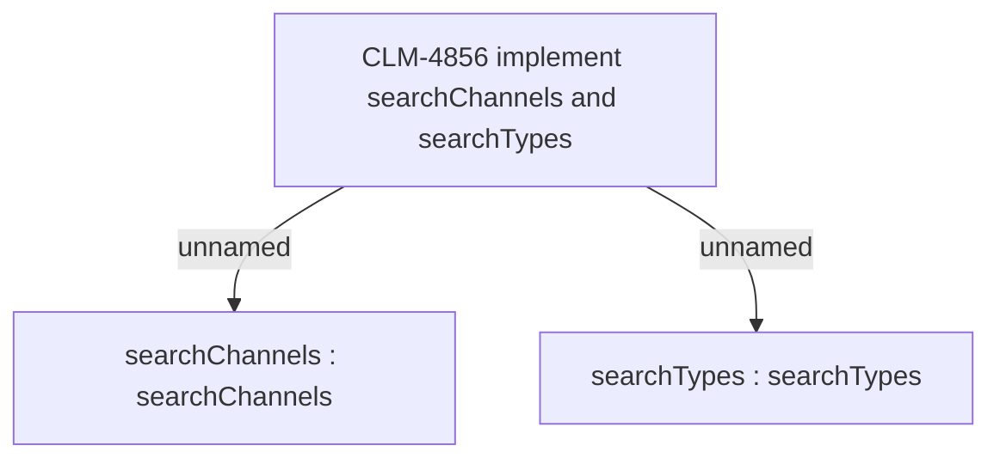

# CLM-4856 implement searchChannels and searchTypes

- **Diagram Type**: Custom
- **Package**: HomerSelect/BSL/Modules/Client center (CLC)/Requirements/CBL-16656/CLM-4856 implement searchChannels and searchTypes
- **Diagram ID**: 156174
- **Elements**: 3
- **Connectors**: 2

