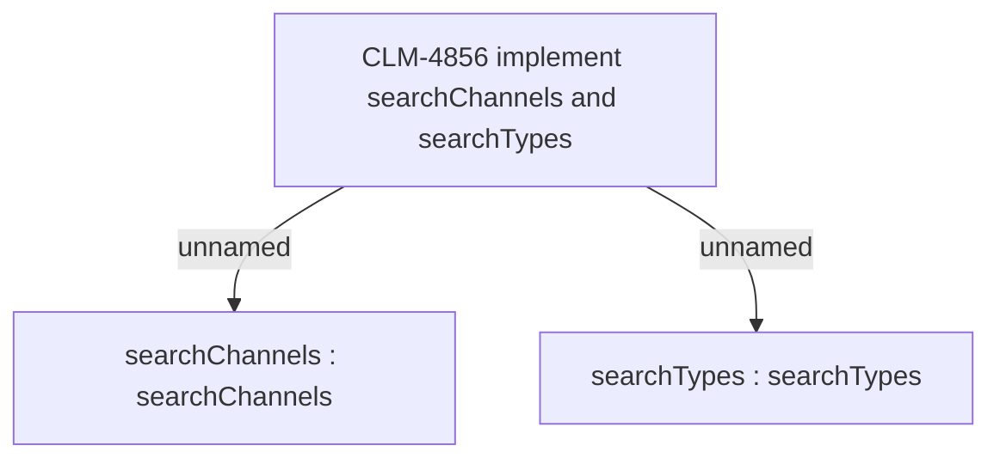

# CLM-4856 implement searchChannels and searchTypes

```mermaid
graph TD
    searchTypes_searchTypes["searchTypes : searchTypes"]
    searchChannels_searchChannels["searchChannels : searchChannels"]
    CLM_4856_implement_searchChannels_and_searchTypes["CLM-4856 implement searchChannels and searchTypes"]
    CLM_4856_implement_searchChannels_and_searchTypes -->|unnamed| searchChannels_searchChannels
    CLM_4856_implement_searchChannels_and_searchTypes -->|unnamed| searchTypes_searchTypes
```
