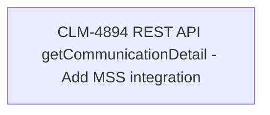

# CLM-4894 REST API getCommunicationDetail - Add MSS integration

- **Diagram Type**: Custom
- **Package**: HomerSelect/BSL/Modules/Client center (CLC)/Requirements/CBL-16656/CLM-4894 REST API getCommunicationDetail - Add MSS integration
- **Diagram ID**: 156177
- **Elements**: 1
- **Connectors**: 0

