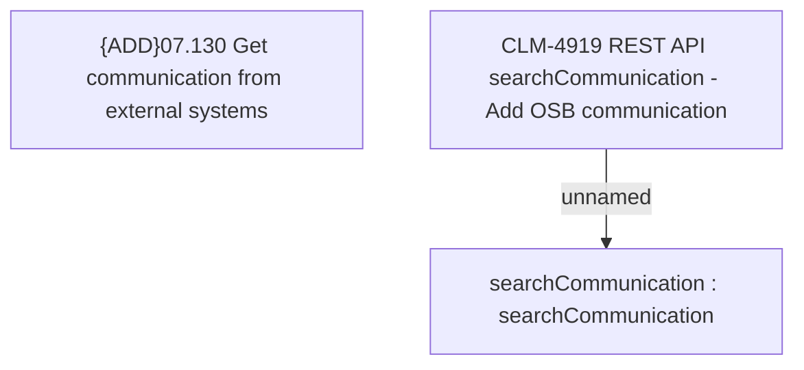

# CLM-4919 REST API searchCommunication - Add OSB communication

```mermaid
graph TD
    ADD_07_130_Get_communication_from_external_systems["{ADD}07.130 Get communication from external systems"]
    searchCommunication_searchCommunication["searchCommunication : searchCommunication"]
    CLM_4919_REST_API_searchCommunication_Add_OSB_communication["CLM-4919 REST API searchCommunication - Add OSB communication"]
    CLM_4919_REST_API_searchCommunication_Add_OSB_communication -->|unnamed| searchCommunication_searchCommunication
```
