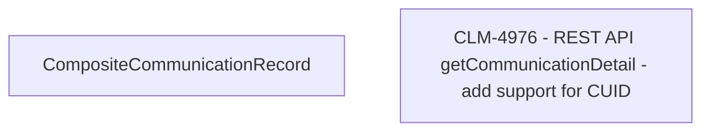

# CLM-4976 REST API getCommunicationDetail - add support for CUID

- **Diagram Type**: Custom
- **Package**: HomerSelect/BSL/Modules/Client center (CLC)/Requirements/CBL-16656/CLM-4976 REST API getCommunicationDetail - add support for CUID
- **Diagram ID**: 156178
- **Elements**: 2
- **Connectors**: 0

