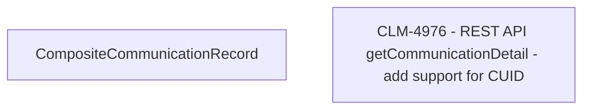

# CLM-4976 REST API getCommunicationDetail - add support for CUID

```mermaid
graph TD
    CompositeCommunicationRecord["CompositeCommunicationRecord"]
    CLM_4976_REST_API_getCommunicationDetail_add_support_for_CUI["CLM-4976 - REST API getCommunicationDetail - add support for CUID"]
```
