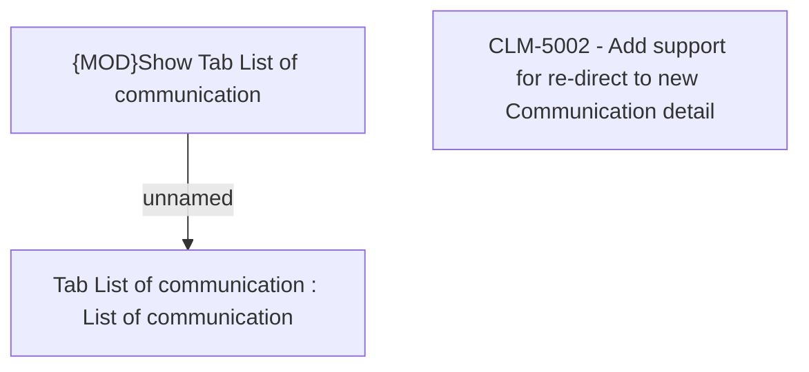

# CLM-5002 - Add support for re-direct to new Communication detail

```mermaid
graph TD
    Tab_List_of_communication_List_of_communication["Tab List of communication : List of communication"]
    MOD_Show_Tab_List_of_communication["{MOD}Show Tab List of communication"]
    CLM_5002_Add_support_for_re_direct_to_new_Communication_deta["CLM-5002 - Add support for re-direct to new Communication detail"]
    MOD_Show_Tab_List_of_communication -->|unnamed| Tab_List_of_communication_List_of_communication
```
