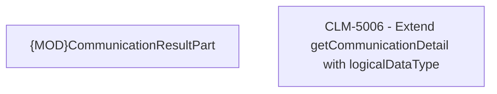

# CLM-5006 - Extend getCommunicationDetail with logicalDataType

- **Diagram Type**: Custom
- **Package**: HomerSelect/BSL/Modules/Client center (CLC)/Requirements/CBL-16656/CLM-5006 - Extend getCommunicationDetail with logicalDataType/CLM-5006 - Extend getCommunicationDetail with logicalDataType
- **Diagram ID**: 156296
- **Elements**: 2
- **Connectors**: 0

