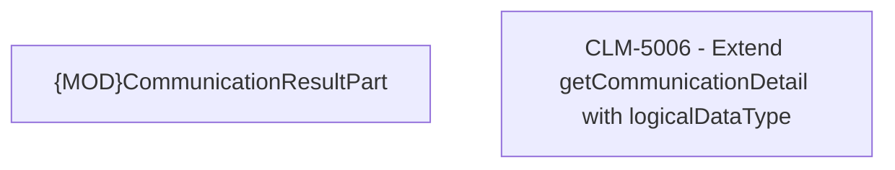

# CLM-5006 - Extend getCommunicationDetail with logicalDataType

```mermaid
graph TD
    MOD_CommunicationResultPart["{MOD}CommunicationResultPart"]
    CLM_5006_Extend_getCommunicationDetail_with_logicalDataType["CLM-5006 - Extend getCommunicationDetail with logicalDataType"]
```
