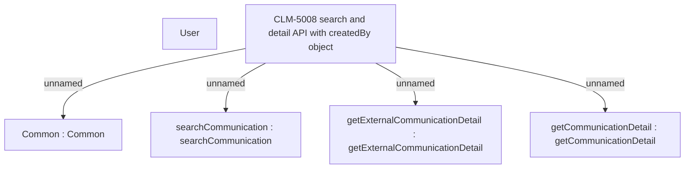

# CLM-5008 search and detail API with createdBy object

- **Diagram Type**: Custom
- **Package**: HomerSelect/BSL/Modules/Client center (CLC)/Requirements/CBL-16656/CLM-5008 search and detail API with createdBy object
- **Diagram ID**: 156180
- **Elements**: 6
- **Connectors**: 4

